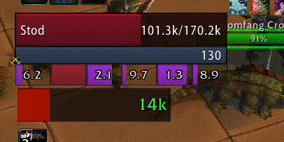

# DeathStrikeHealingMeter

**DeathStrikeHealingMeter** is a lightweight, configurable World of Warcraft addon that visually tracks Death Strike healing potential and recent damage windows for Death Knights in Cataclysm Classic.



---

## ✨ Features

- 🔍 Tracks recent damage over a configurable time window
- 💉 Displays how much healing Death Strike would provide
- 📊 Visualizes healing as a predictive bar overlay
- 🎯 Adjustable thresholds for “large” heals
- 🎨 Fully customizable: position, size, colors, fonts, textures
- 🧩 Supports in-combat / out-of-combat alpha fading
- 🔄 Drag to move, with optional frame lock

---

## ⚙️ Configuration

### 🧭 Options Panel  
You can find the options under:

> **ESC → Interface → AddOns → DeathStrikeHealingMeter**

From here you can customize:

- Bar size, position, and texture  
- Prediction and healing text sizes  
- Alpha settings and animation direction  
- Color settings for bars and healing  

> 🛠 Some settings may require a `/reload` to take effect

---

## 🔧 Slash Commands

```bash
/reload                     - Reloads the UI
/dshm or /deathstrikeheal   - Opens the options panel
